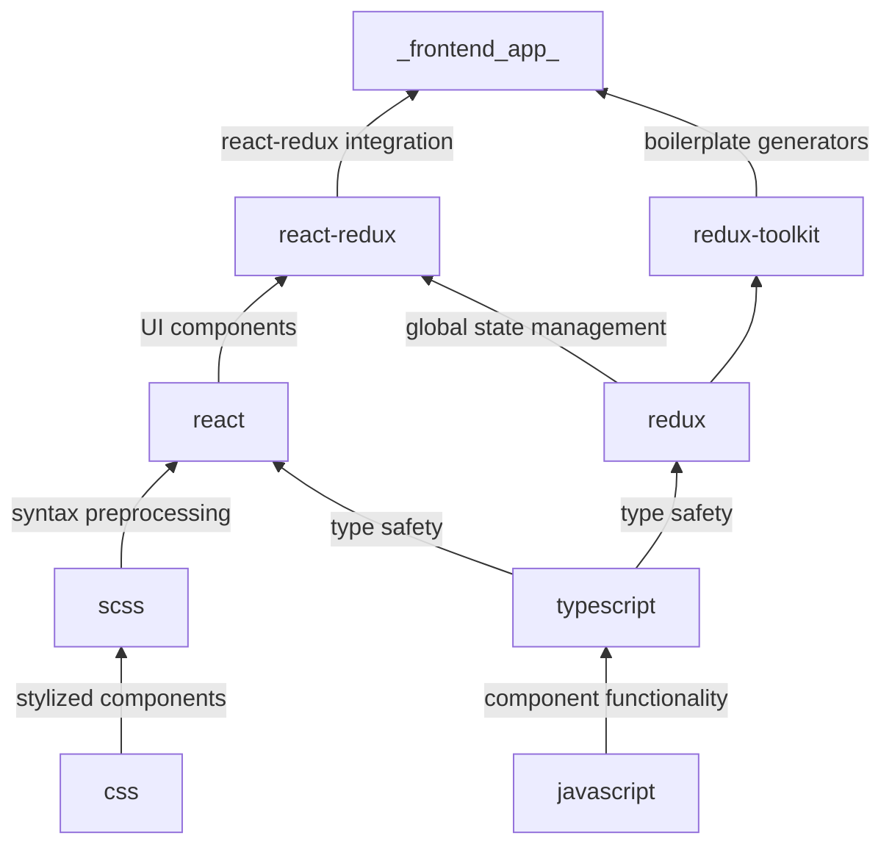

# Frontend Technology Stack

This document details the stack of technologies all CodeForLife frontend's will rely on. This graph, from bottom to top, describes the technologies used and what they provide to the next layer.

## Programming Language

Our front end 

