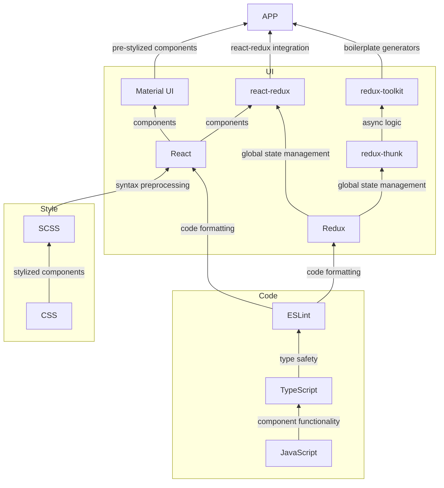

# Frontend Technology Stack

This document details the stack of technologies all CodeForLife frontend's will rely on. This graph, from bottom to top, names the technologies used and what they provide to the next layer.



The following sections describe what benefit each technology brings to the stack.

## Code

### JavaScript (JS)

JS is our programming language of choice. It will define the webpage behavior on clients' devices.

### TypesScript (TS)

TS builds on top of JS to provide type safety. Type safety provides many crucial benefits for a medium-to-large scale project:

1. Static [variable] typing. This improves readability and also allows for build-time errors (rather than run-time).
1. Great tooling support with IntelliSense (code recommendations/snippets).
1. Allows for backwards compatibility with older versions of JS. TS can be compiled to old JS versions.

### ESLint

ESLint is a JS/TS library. It builds on top of TS to provide consist code formatting conventions. Well formatted code improves readability for developers. When code is pushed to a branch, a pipeline will auto-run ESLint to check the formatting of your code - unformatted code will be rejected.

## Style

### CSS

Used to describe the style of our web page.

### SCSS

**NOTE:** SCSS is also known as SASS. The small difference between them is how their syntax. SCSS uses curly braces to define scopes while SASS uses indentations. We will be using SCSS.

SCSS builds on top of CSS to provide cleaner CSS syntax. This provides many important benefits that will reduce the size of CSS code and promote reusability. At build-time, SCSS will compiled to regular CSS.

Key SCSS features:

1. Variables - Create file-level variables to reuse values.
1. Nesting - Define child-styles in the scope of parent styles.
1. Modules - Import SCSS files in other SCSS files.
1. Mixins - Include styles in other styles.
1. Inheritance - Extend parent styles.
1. Operators - For example, mathematical operations.

Read the [official SCSS guide](https://sass-lang.com/guide) for comprehensive descriptions and examples of each feature.

## UI

### React

React is a JS library for building UI components. Our React components will be written in TS. There are two approaches to writing React components: [class components vs functional components](https://reactjs.org/docs/components-and-props.html#function-and-class-components). Functional components are the latest React standard and will be the approach we take.

Key features:

1. Performance - React components have a well structured life-cycle that allow for efficient data rendering. 
1. Readability - Components are structured in a manner that allows developers to directly link data to HTML elements.  
1. Reusability - Generic components can be created to remove boilerplate components.

Required Reading:

1. [Core React Hooks](https://www.valentinog.com/blog/hooks/)
1. [All React Hooks](https://reactjs.org/docs/hooks-reference.html)

### Material UI (MUI)

MUI is a library of React UI components that implements Google's Material Design.

Required Reading:

1. [MUI Components](https://mui.com/material-ui/react-autocomplete/) - familiarize yourself with all the components MUI offers.
1. [MUI Grid v2](https://mui.com/material-ui/react-grid2/) - used for responsive design so understand this thoroughly!

### Redux

Redux is a JS library for managing and centralizing application state.

Redux is critical for medium-to-large scale projects as state management can quickly grow out of control. Furthermore, Redux solves prop-drilling, where data is passed through multiple layers of components. Rather, components will now subscribe to a "global data store" to retrieve the data they require. What's more, any updates made to the relevant data will be synced with any mounted components that are currently using that data.

Required Reading:

1. [Redux Tutorial](https://www.valentinog.com/blog/redux/) - learn how redux can integrated into React components.
1. [Redux Style Guide](https://redux.js.org/style-guide/) - we must follow these redux style guidelines!

NOTE: Redux serves the same purpose as React's native ContextAPI. However, Redux is more sophisticated is generally the standard for production-ready apps.

### react-redux

react-redux is a JS library that integrates Redux into React.

react-redux allows Redux to provide it's "global data store" to all React components in our React app.

```tsx
import { createRoot } from 'react-dom/client';
import { Provider } from 'react-redux';
import { store } from './app/store';

const root = createRoot(document.getElementById('root')!);

root.render(
  <Provider store={store}>
    <App />
  </Provider>
);
```

### redux-thunk

redux-thunk is a JS library that builds on top of Redux. More specifically, it's a Redux middleware. It allows Redux to dispatch asynchronous actions to the store. The most common example of this is fetching data from the database via API calls.

Required Reading:

1. [Writing Logic with Thunks](https://redux.js.org/usage/writing-logic-thunks) - Thunks will encapsulate all sync + async business logic on the frontend.

NOTE: redux-thunk is included in redux-toolkit by default as it's the standard approach to writing async actions with Redux.

### redux-toolkit

redux-toolkit is JS library that builds on top of Redux and redux-thunk, among other important JS libraries (e.g. Immer).

redux-toolkit will help keep our codebase compact, maintainable and readable.

Required Reading:

1. [Redux Tutorial](https://www.valentinog.com/blog/redux/) - learn how toolkit reduces Redux boilerplate.
1. [Introduction to Immer](https://immerjs.github.io/immer/) - Simplifies writing immutable state logic.
