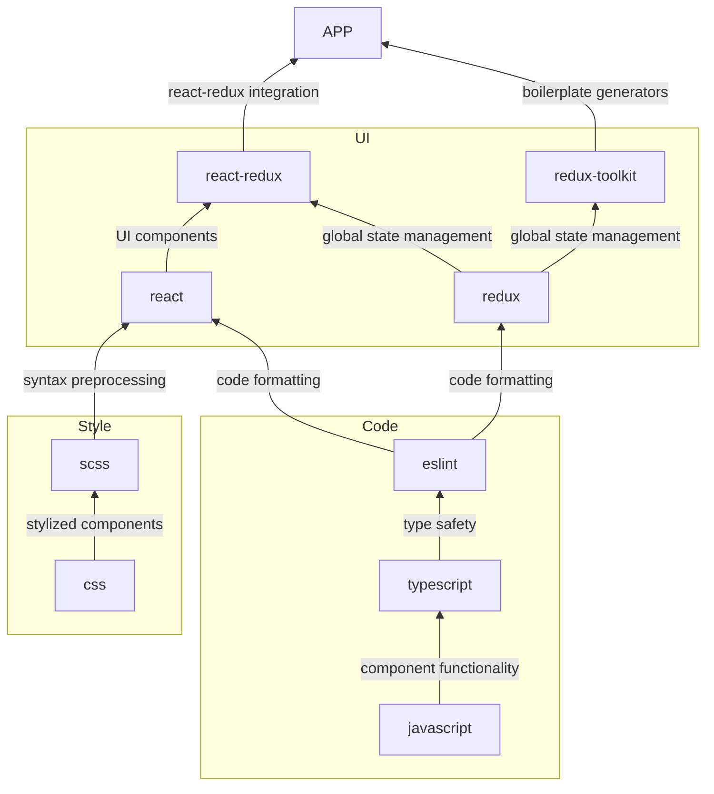

# Frontend Technology Stack

This document details the stack of technologies all CodeForLife frontend's will rely on. This graph, from bottom to top, names the technologies used and what they provide to the next layer.

The following sections describe what benefit each technology brings to the stack.

## Code

### JavaScript (JS)

JS is our programming language of choice. It will define the webpage behavior on clients' devices.

### TypesScript (TS)

TS builds on top of JS to provide type safety. Type safety provides many crucial benefits for a medium-to-large scale project:

1. Static [variable] typing. This improves readability and also allows for build-time errors (rather than run-time).
1. Great tooling support with IntelliSense (code recommendations/snippets).
1. Allows for backwards compatibility with older versions of JS. TS can be compiled to old JS versions.

### ESLint

Builds on top of TypeScript to provide consist code formatting conventions. Well formatted code improves readability for developers.

## Style

### CSS

Used to describe the style of our web page.

### SCSS

**NOTE:** SCSS is also known as SASS. The small difference between them is how their syntax. SCSS uses curly braces to define scopes while SASS uses indentations. We will be using SCSS.

SCSS builds on top of CSS to provide cleaner CSS syntax. This provides many important benefits that will reduce the size of CSS code and promote reusability. At build-time, SCSS will compiled to regular CSS.

Key SCSS features:

1. Variables - Create file-level variables to reuse values.
1. Nesting - Define child-styles in the scope of parent styles.
1. Modules - Import SCSS files in other SCSS files.
1. Mixins - Include styles in other styles.
1. Inheritance - Extend parent styles.
1. Operators - For example, mathematical operations.

Read the [official SCSS guide](https://sass-lang.com/guide) for comprehensive descriptions and examples of each feature.
